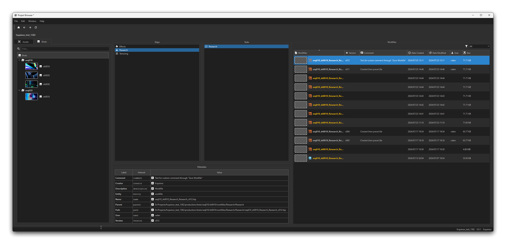

  
  

  <h3 align="center">fxquinox</h3>

  

    USD centric pipeline for feature animation and VFX projects.
      
    <a href="https://healkeiser.github.io/fxquinox"><strong>Documentation</strong></a>
  

  ##

  

    <!-- Maintenance status -->
    &nbsp;&nbsp;
    <!-- &nbsp;&nbsp; -->
    <!-- License -->
    <!-- &nbsp;&nbsp; -->
    <!-- PyPI -->
    <!-- &nbsp;&nbsp; -->
    <!-- Last Commit -->
    &nbsp;&nbsp;
    <!-- Commit Activity -->
    &nbsp;&nbsp;
    <!-- GitHub stars -->
    &nbsp;&nbsp;
  

> [!WARNING]
> This project is a very early WIP.

<!-- TABLE OF CONTENTS -->
## Table of Contents
<!--ts-->
- [Table of Contents](#table-of-contents)
- [About](#about)
- [Acknowledgments](#acknowledgments)
- [Contact](#contact)
<!--te-->

<!-- ABOUT -->
## About
USD centric pipeline for feature animation and VFX projects.

<!-- ACKNOWLEDGMENTS -->
## Acknowledgments

* [Luca Scheller | USD Survival Guide](https://github.com/LucaScheller/VFX-UsdSurvivalGuide)
* [NVidia | USD Scene Construction Utils](https://github.com/NVIDIA-Omniverse/usd_scene_construction_utils)

<!-- CONTACT -->
## Contact

Project Link: [fxquinox](https://github.com/healkeiser/fxquinox)

  <!-- GitHub profile -->
  &nbsp;&nbsp;
  <!-- LinkedIn -->
  &nbsp;&nbsp;
  <!-- Behance -->
  &nbsp;&nbsp;
  <!-- X -->
  &nbsp;&nbsp;
  <!-- Instagram -->
  &nbsp;&nbsp;
  <!-- Gumroad -->
  &nbsp;&nbsp;
  <!-- Gmail -->
  &nbsp;&nbsp;
  <!-- Buy me a coffee -->
  &nbsp;&nbsp;

